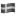
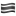

# World Cup 2018

To update, update `data/results.txt` and run `src/app.rb`.

##### Results as of `2018-06-29 09:17:46 -0400`:

| Name | Teams | Score
| :- | - | -
| Vader |       | 15 |
| Carolyn |     | 14 |
| Dan |     | 13 |
| Jason |     | 12 |
| John |     | 10 |
| Alex |     | 9 |
| Hannah |     | 8 |
| Melissa |     | 5 |
| Marcia |     | 4 |
| Tanelle |     | 3 |
